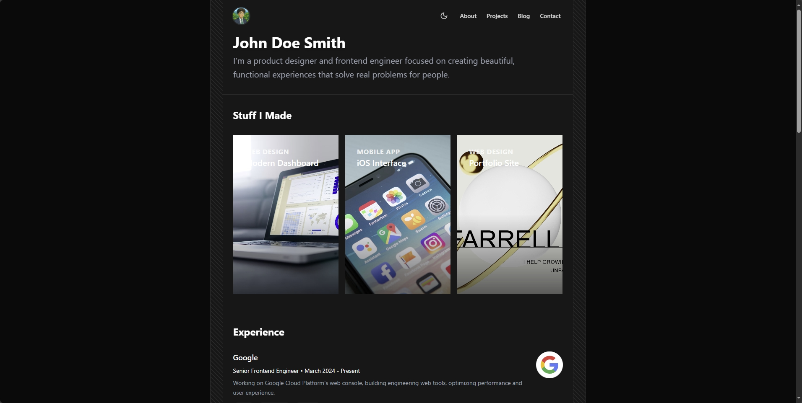

# Minimal Portfolio Template

A modern, responsive portfolio website built with Next.js.

[](https://mnml-portfolio.vercel.app/)

## Tech Stack

- **Framework**: Next.js 15 (React)
- **Language**: TypeScript
- **Styling**: Tailwind CSS
- **Components**: Aceternity UI, Shadcn UI, Radix UI
- **Animations**: Framer Motion
- **Theme**: next-themes (dark/light mode)

## Getting Started

1. Clone the repository
```bash
git clone https://github.com/elijah-farrell/Minimal-Portfolio.git
```

2. Install dependencies
```bash
npm install
```

3. Run the development server
```bash
npm run dev
```

4. Open [http://localhost:3000](http://localhost:3000) in your browser

## Available Scripts

- `npm run dev` - Start development server
- `npm run build` - Build for production
- `npm run start` - Start production server
- `npm run lint` - Run ESLint
